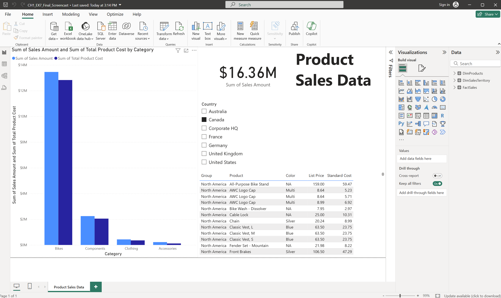
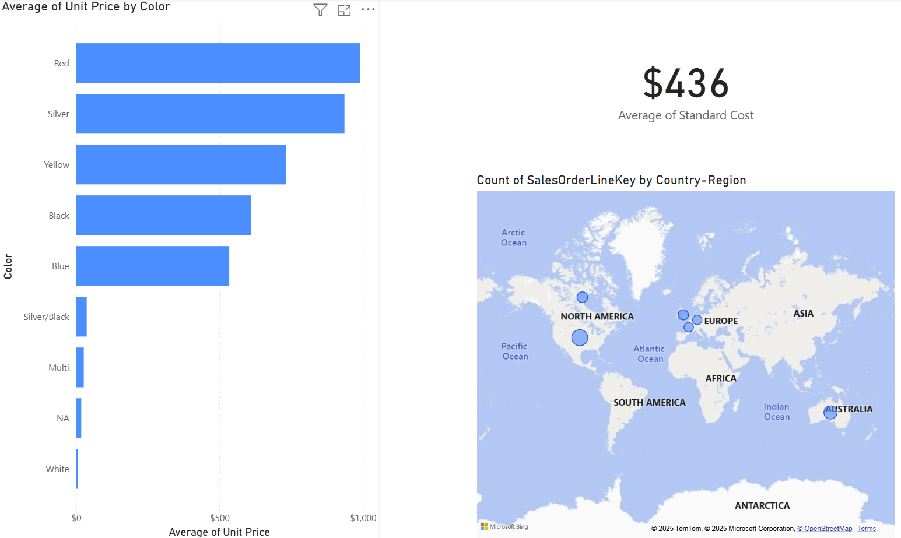
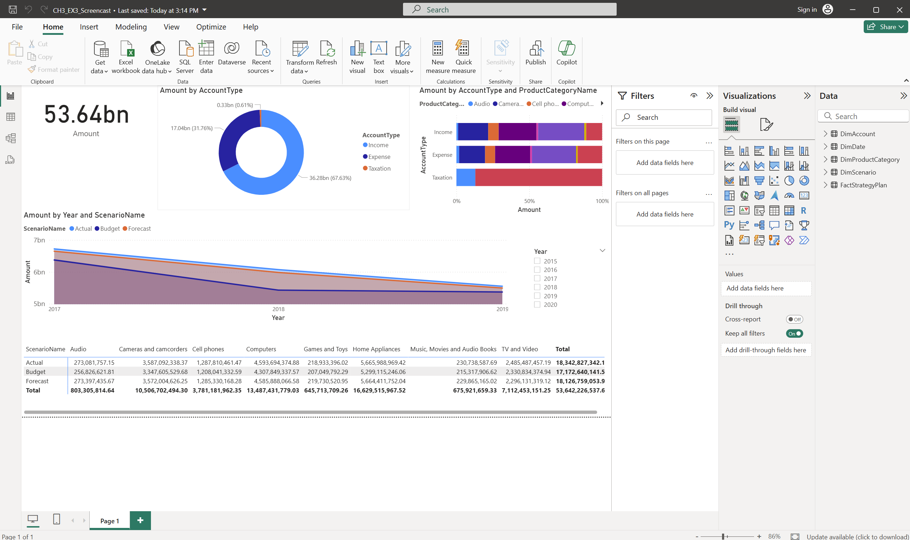

# Introduction to Power BI – DataCamp Course

This repository contains my practical work for the **[Introduction to Power BI](https://app.datacamp.com/learn/courses/introduction-to-power-bi)** course, completed as part of the **Data Analyst in Power BI Career Track** on DataCamp.

The course focuses on loading and transforming data, building dashboards, creating visualizations, and using slicers and filters in Power BI Desktop.

---

## 🗂️ Repository Structure

intro-to-power-bi/
│
├── datasets/ # Source data used in exercises
│ ├── contoso/
│ └── wwi/
│
├── exercises/ # Step-by-step .pbix practice files
│
├── final_dashboards/ # Completed screencast projects (CH1–CH4)
│ ├── CH1_CH2/
│ └── CH3_CH4/
│
├── images/ # Dashboard preview images
│ ├── ch1_dashboard.png
│ ├── ch2_dashboard.png
│ └── ch3_dashboard.png
│
├── certificates/ # Course certificate (PDF)
│
└── README.md

---

## 💡 Skills Practiced

- Importing data from CSV and Excel into Power BI  
- Creating card, bar, table, and map visuals  
- Building slicers and interactive dashboards  
- Applying transformations and field formatting  
- Sorting, filtering, and using hierarchies  
- Understanding the Power BI interface and workflow  

---

## 📊 Dashboard Previews

| Chapter 1 | Chapter 2 | Chapter 3 |
|----------|-----------|-----------|
|  |  |  |

Each dashboard demonstrates key Power BI techniques learned throughout the course, including data modeling, visualization, and interactivity.

---

## 📄 Certificate

- 🔗 [View Certificate on DataCamp](https://www.datacamp.com/completed/statement-of-accomplishment/course/29743a9e36e286cdafac68f3cb639270bf4d85a5)  
- 📎 [Download PDF](./certificates/certificate-intro-to-power-bi.pdf)

---

## 📅 Completed

**June 30, 2025**

👨‍💻 Author: [Oleg Movchaniuk](https://github.com/movcha)